# Dokumentace IPK k druhému projektu

Varianta: ZETA - Síťový sniffer

## Obsah

- [Dokumentace IPK k druhému projektu](#dokumentace-ipk-k-druhému-projektu)
  - [Obsah](#obsah)
  - [Úvod](#úvod)
    - [Funkce aplikace](#funkce-aplikace)
    - [Teorie](#teorie)
  - [Spuštění programu](#spuštění-programu)
  - [Implementace](#implementace)
    - [Zakladní struktura](#zakladní-struktura)
    - [Popis průběhu programu](#popis-průběhu-programu)
      - [Start a zpracování argumentů](#start-a-zpracování-argumentů)
      - [Skenování](#skenování)
      - [Filtrování](#filtrování)
      - [Formátování a výpis](#formátování-a-výpis)
  - [Testování](#testování)
    - [Testovací prostředí](#testovací-prostředí)
    - [Aplikace použité k testování](#aplikace-použité-k-testování)
    - [Průběh testování](#průběh-testování)
      - [Testování zachycení a dekodování paketů](#testování-zachycení-a-dekodování-paketů)
        - [ARP](#arp)
          - [ARP paket zachycen pomocí referenčí aplikace](#arp-paket-zachycen-pomocí-referenčí-aplikace)
          - [ARP paket zachycen pomocí snifferu](#arp-paket-zachycen-pomocí-snifferu)
        - [UDP](#udp)
          - [UDP IPv4 paket zachycen pomocí referenčí aplikace](#udp-ipv4-paket-zachycen-pomocí-referenčí-aplikace)
          - [UDP IPv4 paket zachycen pomocí snifferu](#udp-ipv4-paket-zachycen-pomocí-snifferu)
          - [UDP IPv6 paket zachycen pomocí referenčí aplikace](#udp-ipv6-paket-zachycen-pomocí-referenčí-aplikace)
          - [UDP IPv6 paket zachycen pomocí snifferu](#udp-ipv6-paket-zachycen-pomocí-snifferu)
        - [TCP](#tcp)
          - [TCP IPv4 paket zachycen pomocí referenčí aplikace](#tcp-ipv4-paket-zachycen-pomocí-referenčí-aplikace)
          - [TCP IPv4 paket zachycen pomocí snifferu](#tcp-ipv4-paket-zachycen-pomocí-snifferu)
          - [TCP IPv6 paket zachycen pomocí referenčí aplikace](#tcp-ipv6-paket-zachycen-pomocí-referenčí-aplikace)
          - [TCP IPv6 paket zachycen pomocí snifferu](#tcp-ipv6-paket-zachycen-pomocí-snifferu)
        - [IGMP](#igmp)
          - [IGMPv2 paket zachycen pomocí referenčí aplikace](#igmpv2-paket-zachycen-pomocí-referenčí-aplikace)
          - [IGMPv2 paket zachycen pomocí snifferu](#igmpv2-paket-zachycen-pomocí-snifferu)
        - [ICMPv4](#icmpv4)
          - [ICMPv4 paket zachycen pomocí referenčí aplikace](#icmpv4-paket-zachycen-pomocí-referenčí-aplikace)
          - [ICMPv4 paket zachycen pomocí snifferu](#icmpv4-paket-zachycen-pomocí-snifferu)
        - [ICMPv6](#icmpv6)
          - [ICMPv6 (echo požadavek) paket zachycen pomocí referenčí aplikace](#icmpv6-echo-požadavek-paket-zachycen-pomocí-referenčí-aplikace)
          - [ICMPv6 (echo požadavek) paket zachycen pomocí snifferu](#icmpv6-echo-požadavek-paket-zachycen-pomocí-snifferu)
        - [NDP](#ndp)
          - [NDP podmonžina ICMPv6 (konkretně typ číslo 133) paket zachycen pomocí referenčí aplikace](#ndp-podmonžina-icmpv6-konkretně-typ-číslo-133-paket-zachycen-pomocí-referenčí-aplikace)
          - [NDP podmonžina ICMPv6 (konkretně typ číslo 133) paket zachycen pomocí snifferu](#ndp-podmonžina-icmpv6-konkretně-typ-číslo-133-paket-zachycen-pomocí-snifferu)
        - [MLD](#mld)
          - [MLD podmonžina ICMPv6 (konkretně typ číslo 130) paket zachycen pomocí referenčí aplikace](#mld-podmonžina-icmpv6-konkretně-typ-číslo-130-paket-zachycen-pomocí-referenčí-aplikace)
          - [MLD podmonžina ICMPv6 (konkretně typ číslo 130) paket zachycen pomocí snifferu](#mld-podmonžina-icmpv6-konkretně-typ-číslo-130-paket-zachycen-pomocí-snifferu)
      - [Testování filtrování](#testování-filtrování)
  - [Funkce mimo rozsah zadání](#funkce-mimo-rozsah-zadání)
  - [Bibliografie](#bibliografie)

## Úvod

### Funkce aplikace

Aplikace slouží k zachytávání paketů podle uživatelem zadaných filtrů. Pakety s linkovou vrstvou typu Ethernet jsou zachytávány na zvoleném rozhraní a jejich data jsou vypisována do konzole. Některá data, jako například cílová a zdrojová IP adresa, MAC adresa nebo port, jsou dekódovaná a vypsaná samostatně. Po výpisu dekódovaných dat je přijatý paket také zobrazen ve formě hexadecimálních čísel a ASCII znaků.

### Teorie

Při zachycení paketu, který má linkovou vrstvu typu Ethernet, dostaneme Ethernetový rámec. Rámec na nejnižší úrovni obsahuje například zdrojovou a cílovou MAC adresu. Pokud se jedná o `ARP` požadavek, jsou veškeré přenášené informace uloženy v rámci. Ostatní zachytávané protokoly (`TCP`, `UDP`, `ICMPv4`, `ICMPv6`, `IGMP`, `ARP`) jsou uvnitř rámce zabaleny do IP datagramu[1]. U těchto protokolů je vypsána i jejich zdrojová a cílová IP adresa.

Protocol `ICMPv6` je poté na IP vrstvě dělen do několika typů[2]. Kdy skupina typů `MLD` (Multicast Listener Discovery) zastává v IPv6 stejnou funkci jako `IGMP` v IPv4 a skupina `NDP` (Neighbor Discovery Protocol) zastává v IPv6 stejnou funkci jako `ARP`, `ICMP Router Discovery` a `ICMP Redirect` v IPv4.

Protokoly `TCP` a `UDP` jsou protokoly transportní vrstvy a jsou tedy zabaleny ještě do hlaviček `TCP` respektive `UDP`. U těchto protokolů dochází k výpisu cílového a zdrojového portu aplikace.

## Spuštění programu

Program je potřeba nejdříve přeložit pomocí příkazu `make`. Po přeložení programu ho lze spustit pomocí `./ipk-sniffer`. Při spuštění programu bez argumentů případně s argumentem `-i` nebo `--interface` bez hodnoty se vypíšou všechny dostupné rozhraní, na kterých je možné provádět skenování. Při spuštění se jménem rozhraní (`--interface|-i rozhrani`) je zachycen a vypsán jeden paket z tohoto rozhraní. Pro zachycení jiného počtu paketů slouží argument `-n pocet_paketu`.

Pro filtrování konkrétních druhů paketů slouží tyto přepínače (při použití více přepínačů se mezi nimi aplikuje vztah OR):
`--tcp|-t --udp|-u --icmp4 --icmp6 --arp --igmp --ndp --mld`.

Pro filtrování `TCP` a `UDP` pomocí portu slouží argumenty `-p cislo_portu|--port-destination cislo_portu|--port-source cislo_portu`. Při použití `-p cislo_portu` může být číslo portu zachyceného paketu jak zdrojový port, tak cílový port. Při používání nelze kombinovat `-p` s `--port-destination` nebo `--port-source`. Ovšem `--port-destination` a `--port-source` lze kombinovat.

## Implementace

### Zakladní struktura

Struktura aplikace je rozdělena do dvou hlavních tříd: `Sniffer` a `ProgramStarter`. Třída `ProgramStarter` se stará o zpracování argumentů programu a spuštění Snifferu s těmito argumenty. Také zajišťuje propagaci návratového kódu do funkce `main`. Ve třídě `Sniffer` probíhá samotné skenování, filtrování a vypisování paketů.

Třídy `PacketsToFilterBinder` a `PacketsToFilter` jsou pomocné třídy používané při zpracování argumentů. Tyto třídy jsou potřebné, neboť System.CommandLine omezuje maximální počet argumentů na 8, a více argumentů je potřeba zabalit do instance třídy a namapovat pomocí `Binderu`[3].

### Popis průběhu programu

#### Start a zpracování argumentů

Program začíná ve funkci main vytvořením instance tříd Sniffer a ProgramStarter. Zavolá metodu na přípravu zpracování argumentů, které předá v parametru odkaz na metodu `StartSniffing` ze třídy `Sniffer`. Metoda se předává z důvodu navázání do objektu `rootcommand` a jeho metoda `SetHandler`, aby se při zpracování argumentů zavolala tato metoda a zpracované argumenty se jí předaly. Po přípravě na zpracování je nad instancí `ProgramStarter` zavolána metoda `Start`, která zpracuje argumenty a zavolá předanou metodu.

#### Skenování

Metoda StartSniffing využívá pro práci s pakety knihovnu SharpPcap[4]. Po jejím zavolání provede kontrolu existence attributu rozhraní. Při chybějící hodnotě vypíše list dostupných rozhraní a v případě špatné hodnoty chybu. V případě správné hodnoty začne na daném rozhraní skenovat a zachytávat pakety. Pakety jsou zachytávány v konstrukci `while` dokud se nezachytí požadovaný počet. Pro získání paketu se nad rozhraním volá metoda `GetNextPacket`. Po získání tohoto paketu je zavolána metoda `Filter`, která zjistí, zda-li se má zachycený paket formátovat a vypsat nebo zahodit.

#### Filtrování

Funkce `Filter` přijímá typ `RawCapture`, který zpracuje a postupně kontroluje jednotlivé typy a data, podle kterých má filtrovat. Nejdříve jsou zkontrolovány správné porty, pokud je filtrování podle nich vyžadováno, a jestliže se jedná o `TCP` či `UDP` protokol. Pokud jsou již všechny ostatní přepínače vypnuty a porty sedí, pak je paket validní a může být zobrazen.

Pokud je nějaký přepínač zvolen, probíhá postupná kontrola zahrnující, jaké druhy paketů (protokolů) chceme a jaký druh je tento konkrétní. Druhy paketů se kontrolují pomocí konstrukce `packet.PayloadPacket`, která zjišťuje, jaký druh paketu (protokolů) nese zkoumaný paket. Nejdříve se zkontroluje `ARP`, který jako jediný z filtrovaných není pod hlavičkou IP paketu. Pokud nevyhovuje, tak se zkontrolují všechny ostatní protokoly, které jsou v IP paketu. Nakonec se kontrolují jednotlivé typy `ICMPv6`, a to tedy `ping` (request, response), `NDP` a `MLD`. Pokud ani jeden nevyhovuje, vrátí se informace, že packet validní není, a má se tedy zahodit.

Filtr byl původně napsán jako klasický libpcap filtr. Ovšem z důvodu chybějící podpory pro `IPv6 extended header` byl předělán na již výše zmíněnou vlastní implementaci pomocí `packet.PayloadPacket`.

#### Formátování a výpis

Pokud je paket validní, je pro něj zavolána metoda `ProcessCapturedPacket`. V této metodě se zformátují informace z hlavičky na výpis pomocí metody `CreateHeader` a naformátuje se celý přijatý paket do hexadecimálních čísel ASCII pomocí metody `CreateFormattedData`.

Hlavička je zformátována postupným přidáváním dat z paketu. Nejprve je přidán čas obdržení paketu[5], poté se zkontroluje, zdali se nejedná o Ethernetový rámec, a pokud ano, je formátovaná MAC adresa obsažená v tomto rámci přidána do formátované hlavičky pro výpis. Formátování MAC adresy probíhá přidáním `:` za každé sudé hexadecimální číslo. Následně se přidá délka dat a pro IPPacket se přidá IP adresa[6]. Nakonec je pro protokoly `UDP` a `TCP` přidán i port.

Pro formátování paketu je využita funkce PrintHex z knihovny SharpPcap. Data jsou z této funkce vrácena ve skoro stejné podobě jako se zobrazují v aplikaci Wireshark. Jsou provedeny pouze drobné úpravy, například vymazání některých přebytečných výpisů, jako jsou první 3 řádky s legendou a nebo prefix 'Data: ' před každým řádkem. Také bylo upraveno zobrazení čísel řádků.

## Testování

### Testovací prostředí

Testování probíhalo na dvou zařízeních. Na referenčním virtuálním stroji s využitím referenčního prostředí pro programovací jazyk C#. Referenční prostředí bylo vybráno z dostupného repozitáře [`dev-envs`](https://git.fit.vutbr.cz/NESFIT/dev-envs). Tento referenční virtuální stroj byl spouštěn na zařízení s následujícími specifikacemi:

- Operační systém: Windows 10
- Procesor: Intel Core i5-4690
- Zakladní deska: MSI Z97 GAMING 3 - Intel Z97
- Grafická karta: MSI GTX 970 GAMING 4G

Specifikace dalšího testovacího zařízení, kde probíhalo testování bez referečního stroje:

- Operační systém: macOS verze Sonoma 14.3.1
- Procesor: Apple M1

### Aplikace použité k testování

Pro testování byl jako referenční aplikace použit Wireshark. Pro vytváření a odesílání paketů byl použit Python script využívající knihovnu `Scapy`[7]. Aplikace byla testována jak na těchto vytvořených paketech, tak na běžném síťovém provozu.

### Průběh testování

#### Testování zachycení a dekodování paketů

Testování správnosti zachycení a dekódování probíhalo zachytáváním paketů pomocí vytvořeného snifferu a referenční aplikace. U zachycených paketů byly poté porovnány dekódované data a jejich hexadecimální a ASCII výpis.

Při testování byl odhalen pouze jeden nedostatek. Využívaná funkce `PrintHex` z knihovny `SharpPcap` pro výpis paketu občas přidá na konec paketu data, které se v referenční aplikaci Wireshark nevyskytují. Příčinu a tedy ani řešení tohoto problému se mi nepodařilo odhalit.

##### ARP

###### ARP paket zachycen pomocí referenčí aplikace

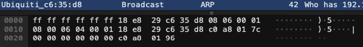

###### ARP paket zachycen pomocí snifferu

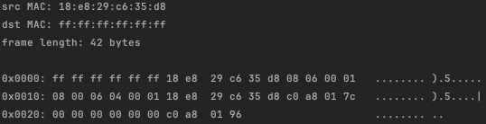

##### UDP

###### UDP IPv4 paket zachycen pomocí referenčí aplikace

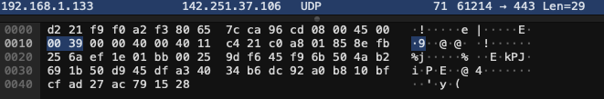

###### UDP IPv4 paket zachycen pomocí snifferu

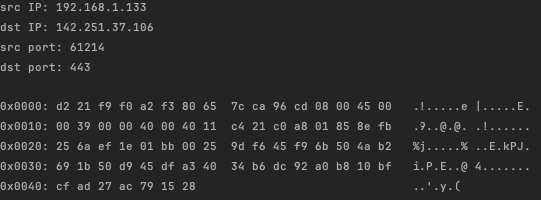

###### UDP IPv6 paket zachycen pomocí referenčí aplikace

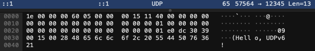

###### UDP IPv6 paket zachycen pomocí snifferu

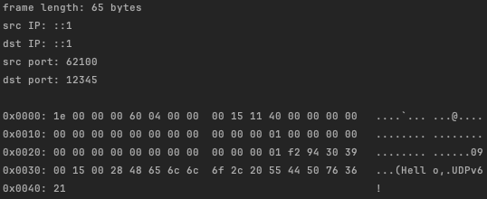

##### TCP

###### TCP IPv4 paket zachycen pomocí referenčí aplikace

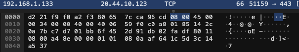

###### TCP IPv4 paket zachycen pomocí snifferu

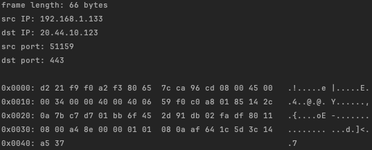

###### TCP IPv6 paket zachycen pomocí referenčí aplikace

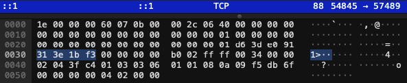

###### TCP IPv6 paket zachycen pomocí snifferu

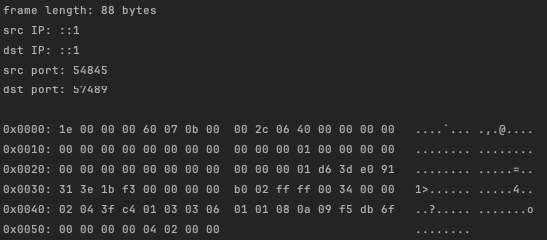

##### IGMP

###### IGMPv2 paket zachycen pomocí referenčí aplikace

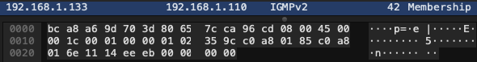

###### IGMPv2 paket zachycen pomocí snifferu

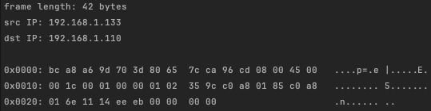

##### ICMPv4

###### ICMPv4 paket zachycen pomocí referenčí aplikace

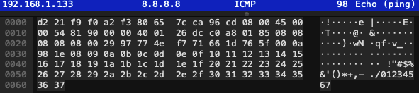

###### ICMPv4 paket zachycen pomocí snifferu

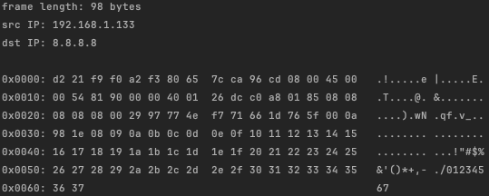

##### ICMPv6

###### ICMPv6 (echo požadavek) paket zachycen pomocí referenčí aplikace

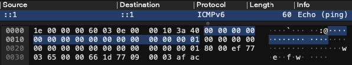

###### ICMPv6 (echo požadavek) paket zachycen pomocí snifferu

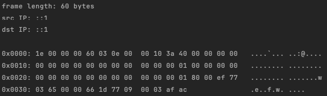

##### NDP

###### NDP podmonžina ICMPv6 (konkretně typ číslo 133) paket zachycen pomocí referenčí aplikace

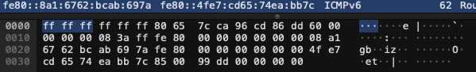

###### NDP podmonžina ICMPv6 (konkretně typ číslo 133) paket zachycen pomocí snifferu

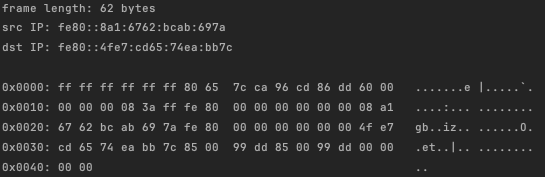

##### MLD

###### MLD podmonžina ICMPv6 (konkretně typ číslo 130) paket zachycen pomocí referenčí aplikace

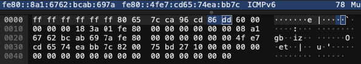

###### MLD podmonžina ICMPv6 (konkretně typ číslo 130) paket zachycen pomocí snifferu

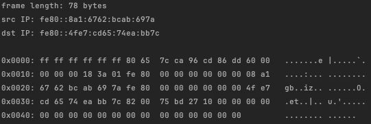

#### Testování filtrování

Testování filtrování paketů probíhalo nastavováním kombinací filtrů. Tyto filtry byly nastaveny jak ve vytvořené aplikaci, tak v referenční. Následně bylo zkontrolováno, zda-li obě aplikace zachytili stejné a správné druhy paketů.

## Funkce mimo rozsah zadání

Díky zvolenému filtrování paketů pomocí `packet.PayloadPacket` je zajištěna podpora `IPv6 Extension Headers`.

## Bibliografie

[1]: Wikipedie. TCP/IP [online]. Říjen 2023. [citováno 2024-04-15]. Dostupné z: [https://cs.wikipedia.org/wiki/TCP/IP](https://cs.wikipedia.org/wiki/TCP/IP)

[2]: Wikipedie. ICMPv6 [online]. Červen 2023. [citováno 2024-04-15]. Dostupné z: [https://en.wikipedia.org/wiki/ICMPv6](https://en.wikipedia.org/wiki/ICMPv6)

[3]: Microsoft. System.CommandLine overview [online]. [citováno 2024-04-15]. Dostupné z: [https://learn.microsoft.com/en-us/dotnet/standard/commandline/](https://learn.microsoft.com/en-us/dotnet/standard/commandline/)

[4] Morgan, C. sharppcap [online]. [citováno 2024-04-15]. Dostupné z: [https://github.com/dotpcap/sharppcap](https://github.com/dotpcap/sharppcap)

[5] Sebastian, N. C# DateTime to RFC3339/ISO 8601 [online]. [citováno 2024-04-15]. Dostupné z: [https://sebnilsson.com/blog/c-datetime-to-rfc3339-iso-8601/](https://sebnilsson.com/blog/c-datetime-to-rfc3339-iso-8601/)

[6] Kawamura, S a Kawashima M. A Recommendation for IPv6 Address Text Representation [online]. Srpen 2010. [citováno 2024-04-15]. DOI: 10.17487/RFC5952. Dostupné z: [https://datatracker.ietf.org/doc/html/rfc5952](https://datatracker.ietf.org/doc/html/rfc5952)

[7] Biondi, P. Scapy [online]. [citováno 2024-04-15]. Dostupné z: [https://scapy.net/](https://scapy.net/)
